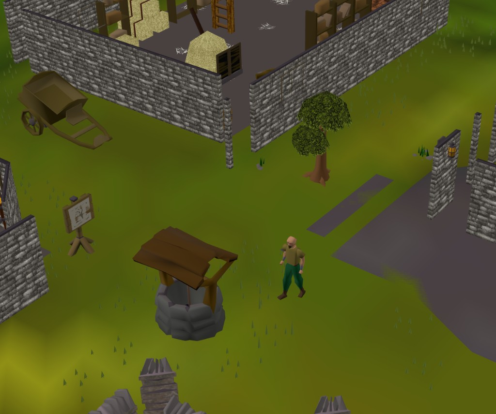

# RuneBox

A browser-based **RuneScape sandbox** built on a live **377 cache**. RuneBox decodes Jagex map, landscape, and model data in Python, exports GLB on demand, and renders it in the browser with **WebGL / Three.js** — terrain, scenery, NPCs, and UI sprites straight from cache.




## Getting Started

### 1. Download a game cache (not included)

RuneBox does **not** ship Jagex game data. You need a local cache extract.

1. Go to **[OpenRS2 Archives](https://archive.openrs2.org/caches)**
2. Pick a build — **revision 377** is what this project was developed against (317 and 474 also work for many features)
3. Download as **flatfile** (not the .dat/idx version)
4. Extract the archive

You should get a folder containing `main_file_cache.dat` and `main_file_cache.idx0`–`idx4` (sometimes inside a nested `cache/` subfolder).

### 2. Place the cache in the project

Copy the cache files into **`cache/`** at the repo root:

```text
RuneBox/
  cache/
    main_file_cache.dat
    main_file_cache.idx0
    main_file_cache.idx1
    main_file_cache.idx2
    main_file_cache.idx3
    main_file_cache.idx4
```

RuneBox also checks `rs-sandbox-world/cache/` if the root folder is empty.

If your OpenRS2 download has an extra wrapper directory, copy only the inner files that contain `main_file_cache.dat`. You can also set `RS_CACHE` in `.env` to point at any cache directory.

### 4. Install and run

```bash
cd rs-sandbox-world
python -m venv .venv
.venv\Scripts\activate          # Windows
# source .venv/bin/activate     # macOS / Linux
pip install -r requirements.txt
python -m src.cli.serve_viewer
```

Open **http://127.0.0.1:8848**

Verify the cache is detected:

```bash
python -m src.cli.cache_status
```

### 5. Explore

| Mode | What it does |
|------|----------------|
| **Browse** | NPCs, objects, locations, spot anims from cache |
| **World** | Load RS377 regions (terrain + landscape locs), tile editor, walk around, combat |
| **Chess** | 8×8 board with RS NPC pieces, capture combat choreography |
| **Creator** | Human character builder (idk kits) or **clone NPC** with model parts & recolours |
| **Rave** | Dance floor zone with stage video |

## How it works

| Layer | Role |
|-------|------|
| **Python** | Reads OpenRS2 flatfile cache — maps (XTEA), landscape locs, models, sprites, fonts |
| **Export** | Synthesizes GLB/PNG on demand (`LocType.getModel`, region terrain mesh, minimap) |
| **Three.js** | `rs_viewer.html` — WebGL terrain, scenery placement, 317-style camera & minimap |

Region loading mirrors the 317 client: `SceneBuilder.readLocs` tile/kind/rotation, wall placement at tile centres, and baked model rotation in export.

## Project layout

```text
cache/              # Your OpenRS2 flatfile extract (contents gitignored)
docs/               # README screenshots
rs-sandbox-world/   # Python cache pipeline + web viewer
  src/              # Cache I/O, model decode, GLB export, CLI
  web/              # Three.js viewer (rs_viewer.html)
showcase.png
```

## Requirements

- Python 3.11+
- An OpenRS2 flatfile cache in `cache/`
- Optional: Java 17+ and Maven with `RS_JAVA_CLIENT_DIR` set for the Java cache bridge

## License

Game assets (models, textures, sounds) belong to Jagex Ltd. This project is a fan sandbox / tooling exercise — not affiliated with or endorsed by Jagex.
