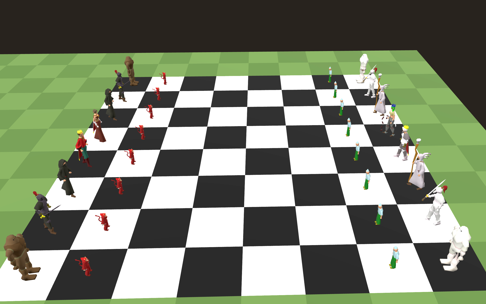

# RuneBox

A browser-based **RuneScape sandbox** built on a live game cache. Explore NPCs, objects, and scenery as GLB models, edit tile worlds, play chess with animated NPC pieces, customize characters, and clone NPCs with per-part recolours — all synthesized on demand in Python.



## Getting Started

### 1. Clone this repo

```bash
git clone https://github.com/KyleSau/RuneBox.git
cd RuneBox
```

### 2. Download a game cache (not included)

RuneBox does **not** ship Jagex game data. You need a local cache extract.

1. Go to **[OpenRS2 Archives](https://archive.openrs2.org/caches)**
2. Pick a build — **revision 377** is what this project was developed against (317 and 474 also work for many features)
3. Download as **flatfile** (not the SQLite database)
4. Extract the archive

You should get a folder containing `main_file_cache.dat` and `main_file_cache.idx0`–`idx4` (sometimes inside a nested `cache/` subfolder).

### 3. Place the cache in the project

Copy the cache files into the universal **`cache/`** folder at the repo root:

```text
RuneBox/
  cache/
    main_file_cache.dat
    main_file_cache.idx0
    main_file_cache.idx1
    main_file_cache.idx2
    main_file_cache.idx3
    main_file_cache.idx4
```

Alternatively, you can use `tools/rs-sandbox-world/cache/` — RuneBox checks the repo root first, then the sandbox folder.

If your OpenRS2 download has an extra wrapper directory, copy only the inner files that contain `main_file_cache.dat`. You can also point to any path with the `RS_CACHE` environment variable (see `.env.example`).

### 4. Install and run

```bash
cd tools/rs-sandbox-world
python -m venv .venv
.venv\Scripts\activate          # Windows
# source .venv/bin/activate     # macOS / Linux
pip install -r requirements.txt
python -m src.cli.serve_viewer
```

Open **http://127.0.0.1:8848**

Verify the cache is detected:

```bash
python -m src.cli.cache_status
```

### 5. Explore

| Mode | What it does |
|------|----------------|
| **Browse** | NPCs, objects, locations, spot anims from cache |
| **World** | Tile editor, place scenery/NPCs, walk around, combat |
| **Chess** | 8×8 board with RS NPC pieces, capture combat choreography |
| **Creator** | Human character builder (idk kits) or **clone NPC** with model parts & recolours |
| **Rave** | Dance floor zone with stage video |

## Project layout

```text
cache/                    # Your OpenRS2 flatfile extract (gitignored contents)
tools/rs-sandbox-world/   # Main app: Python cache pipeline + web viewer
  src/                    # Cache I/O, model decode, GLB export, CLI
  web/                    # Three.js viewer (rs_viewer.html)
tools/ai-backends/        # Optional text-to-mesh backends (Hunyuan3D, TripoSR)
showcase.png              # Screenshot for GitHub
```

## Local reference material (gitignored)

These folders are useful locally but not shipped in the repo:

- `RuneScape-317-client/` — 317 client for Java cache bridge
- `elvarg-rsps-master/` — RSPS reference
- `apollo-kotlin-experiments/` — Apollo/Kotlin experiments
- `concepts/` — design notes
- `cache-runescape*/` — legacy OpenRS2 folder names still work via `RS_CACHE`

## Requirements

- Python 3.11+
- An OpenRS2 flatfile cache (317, 377, or 474) in `cache/`
- Optional: Java 17+ and Maven (for Java cache bridge via `RuneScape-317-client`)

## License

Game assets (models, textures, sounds) belong to Jagex Ltd. This project is a fan sandbox / tooling exercise — not affiliated with or endorsed by Jagex.
